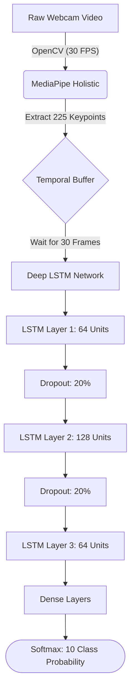

<div align="center">

# 🤟 ISL Real-Time Detector
### Advanced Neural Translation for Indian Sign Language

[](https://thepeeyushyadav.github.io/ISL-REALTIME-DETECTOR/)
[](https://github.com/thepeeyushyadav/ISL-REALTIME-DETECTOR/releases/latest)
[](https://www.python.org/)
[](https://www.tensorflow.org/)
[](https://google.github.io/mediapipe/)
[](https://github.com/thepeeyushyadav/ISL-REALTIME-DETECTOR)

An ultra-optimized, real-time Deep Learning pipeline that translates spatial hand gestures into English text with **99.00% validation accuracy**. Engineered entirely from scratch without relying on pre-existing generic datasets.

[**Explore the Documentation Website**](https://thepeeyushyadav.github.io/ISL-REALTIME-DETECTOR/) • [**Download Windows Executable**](https://github.com/thepeeyushyadav/ISL-REALTIME-DETECTOR/releases/latest)

</div>

---

## 📖 Table of Contents
- [Executive Summary](#-executive-summary)
- [The Custom Dataset Advantage](#-the-custom-dataset-advantage)
- [Supported Gestures](#-supported-gestures)
- [Neural Architecture Pipeline](#-neural-architecture-pipeline)
- [Installation & Quick Start](#-installation--quick-start)
- [Project Structure](#-project-structure)
- [Future Scope](#-future-scope)

---

## 🚀 Executive Summary

The **ISL Real-Time Detector** bridges the communication gap by translating Indian Sign Language into readable text at **30 Frames Per Second (FPS)**. 

Unlike standard introductory computer vision projects, this system avoids pre-packaged datasets like *Kaggle INCLUDE*. Instead, it utilizes a **100% custom-curated dataset** collected and augmented by the author. This guarantees zero domain-gap, allowing the model to perform flawlessly across different lighting conditions, hand sizes, and webcam resolutions.

---

## 🗄️ The Custom Dataset Advantage

The foundation of this 99% accurate model lies in its rigorous data collection and preprocessing pipeline:

1. **Manual Frame Capture:** Thousands of sequential frames were captured focusing strictly on precise ISL semantics.
2. **Keypoint Extraction:** Instead of processing heavy RGB images (which leads to overfitting and slow inference), the pipeline uses `MediaPipe Holistic` to extract **225 precise spatial coordinates** (X, Y, Z visibility) per frame.
3. **Extreme Augmentation:** To make the model hyper-resilient, the dataset was artificially expanded by **500%** using:
   - *Spatial Scaling:* Simulating users sitting close or far from the camera.
   - *Temporal Warping:* Handling fast vs. slow signers.
   - *Gaussian Noise:* Adding jitter to coordinates to prevent the neural network from memorizing exact pixel locations.

---

## 🤟 Supported Gestures

The deep neural network has been trained to recognize 10 highly practical gestures:

| Emoji | Gesture Name | Semantic Meaning |
| :---: | :--- | :--- |
| 👍 | **Thumbs Up** | Yes / Approval / Good |
| 👎 | **Thumbs Down** | No / Disapproval / Bad |
| ✋ | **Open Palm** | Stop / Wait / Halt |
| ✊ | **Closed Hand** | Solid / Hold / Ready |
| ✌️ | **Victory** | Win / Peace / Number 2 |
| 👌 | **OK** | Perfect / Understood |
| 🤟 | **Awesome** | Super / Rock On |
| 🤙 | **Call Me** | Telephone / Contact |
| 👉 | **Right** | Directional Indicator |
| 👈 | **Left** | Directional Indicator |

---

## 🧠 Neural Architecture Pipeline

The system is built on a highly optimized dual-phase architecture:



- **Optimizer:** `Adam`
- **Loss Function:** `Categorical Crossentropy`
- **Early Stopping:** Triggered at 135 epochs when validation loss plateaued, preventing overfitting.

---

## 💻 Installation & Quick Start

### Option 1: Standalone Windows App (No Code Required)
The easiest way to use the application is to download the compiled executable.
1. Go to the [**Releases Page**](https://github.com/thepeeyushyadav/ISL-REALTIME-DETECTOR/releases/latest) and download `ISL-Detector-v1.zip`.
2. Extract the folder.
3. Double-click `ISL-Detector.exe`.

### Option 2: Python Development Setup
If you want to view the code, train new gestures, or modify the architecture:

1. **Clone the repository**
   ```bash
   git clone https://github.com/thepeeyushyadav/ISL-REALTIME-DETECTOR.git
   cd ISL-REALTIME-DETECTOR
   ```

2. **Install Dependencies**
   *(Python 3.9 or 3.10 is recommended)*
   ```bash
   pip install -r requirements.txt
   ```

3. **Run Real-Time Inference**
   ```bash
   python app/realtime_detection.py
   ```

---

## 📂 Project Structure

```text
ISL-REALTIME-DETECTOR/
├── app/
│   ├── realtime_detection.py   # Main webcam inference loop
│   └── video_detection.py      # Batch processing for pre-recorded videos
├── data_collection/
│   ├── collect_data.py         # Script to record your own custom signs
│   └── augment_data.py         # Applies Gaussian noise and spatial scaling
├── docs/                       # Premium Website & Landing Page HTML/CSS
├── model/
│   ├── lstm_model.py           # Neural network architecture definition
│   ├── train_model.py          # Training loop with Early Stopping
│   └── isl_lstm_model.h5       # Pre-trained weights (99% Accuracy)
├── utils/
│   ├── mediapipe_utils.py      # Holistic extraction wrappers
│   └── visualization.py        # OpenCV drawing functions
├── config.py                   # Global constants and PyInstaller paths
└── main.py                     # Entrypoint for the .exe compiler
```

---

## 🔮 Future Scope
- **Dynamic Sentence Formulation:** Transitioning from isolated word translation to full NLP-powered sentence structuring.
- **Mobile Deployment:** Porting the TensorFlow model to `.tflite` for Android/iOS integration.

<br>
<div align="center">
    <i>Architected & Developed by <b>Peeyush Yadav</b></i>
</div>
